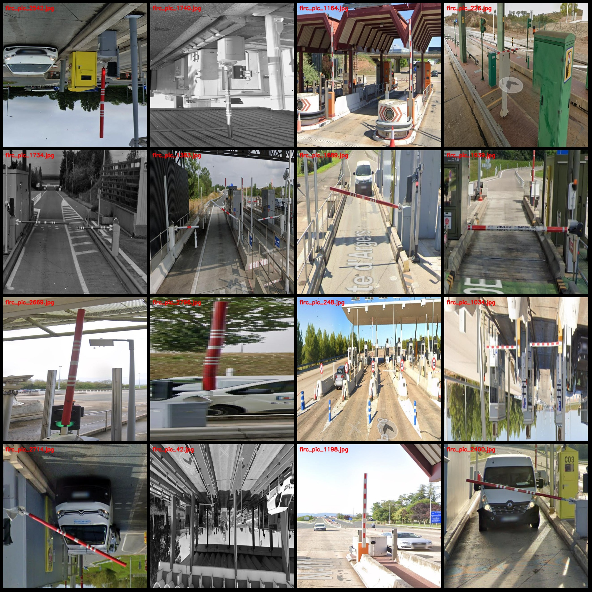
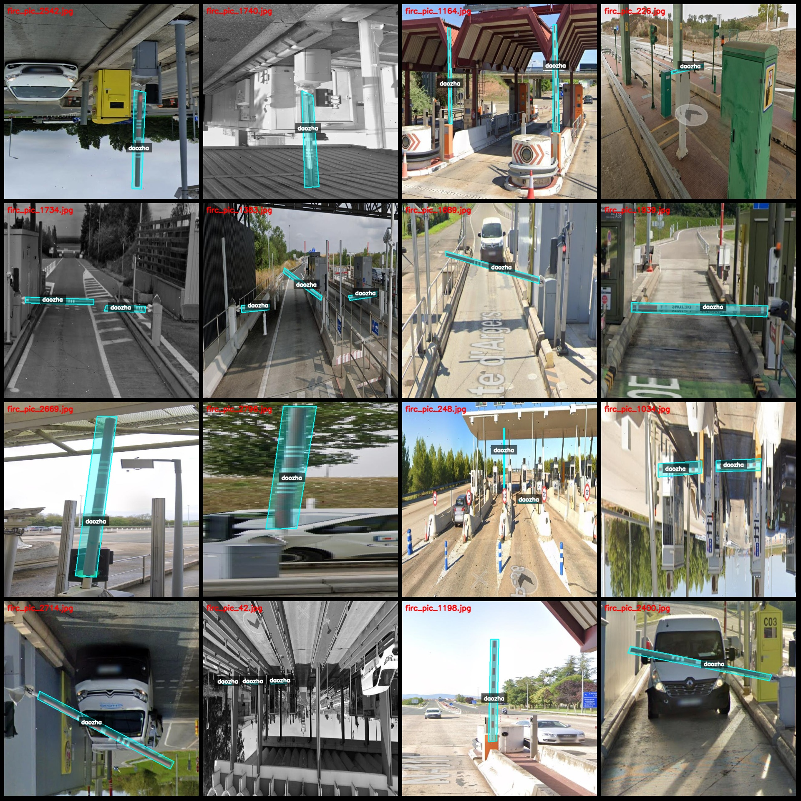
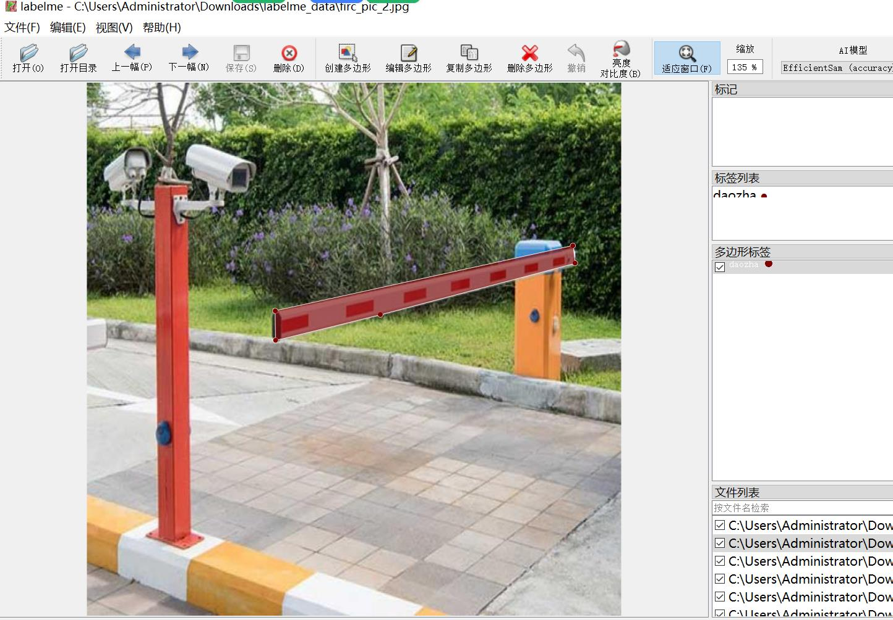

# Charging Gate Parking Lot Entry and Exit Entry/Exit Detection Data Set in labelme Format with 2869 Entries

Dataset format: labelme format (excluding mask files, only containing JPG images and corresponding JSON files)
Number of images (JPG file count): 2869
Number of annotations (JSON file count): 2869
Number of categories: 1
Annotation category name: ["daozha"]
Number of boxes per category: 4737
Total boxes: 4737
Annotation tool: labelme version 5.5.0
Image resolution: 640x640
Annotation rules: Polygons are drawn around the category
Important note: The dataset can be edited using labelme, but the JSON data set needs to be converted into either mask or yolo format for semantic segmentation or instance segmentation.
Special declaration: This dataset does not guarantee the accuracy of the trained models or weight files.
Preview of images:
Annotation examples:
Original images (select 16 randomly):
Annotation drawing results:
Labelme editing image examples:

## Images

Here is a pay link on Stripe ( https://buy.stripe.com/3cs8yP7sY87d0vu9AB ). Please contact me lonlonago@foxmail.com after funding $89, and I will send you a complete data files , thank you!

